# MOHSTORE — UML Sequence Diagrams

> Generated from live codebase analysis.  
> Stack: Next.js · Node.js · PostgreSQL · JWT (HS256)

---

## 1. User Registration

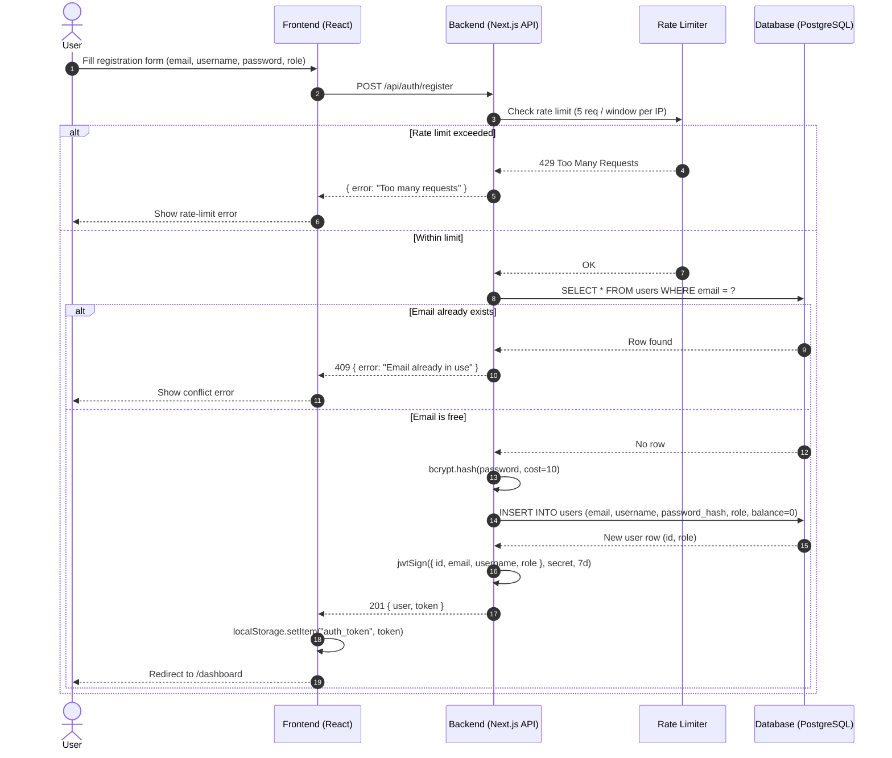

---

## 2. User Login

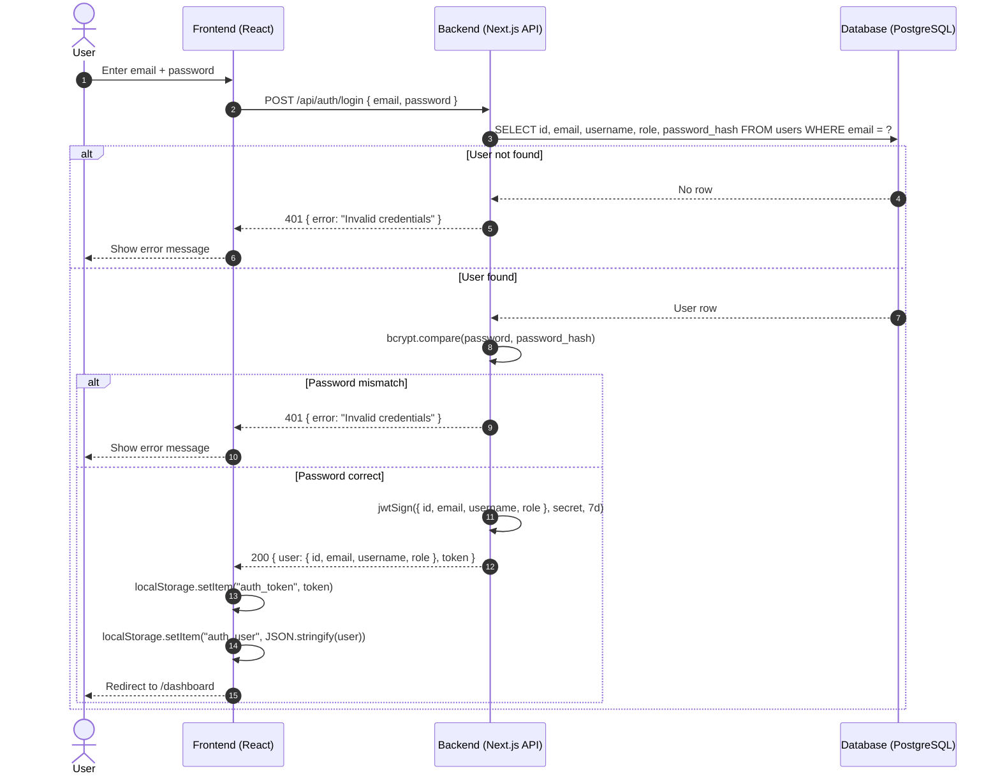

---

## 3. Add Offer / Product (Seller)

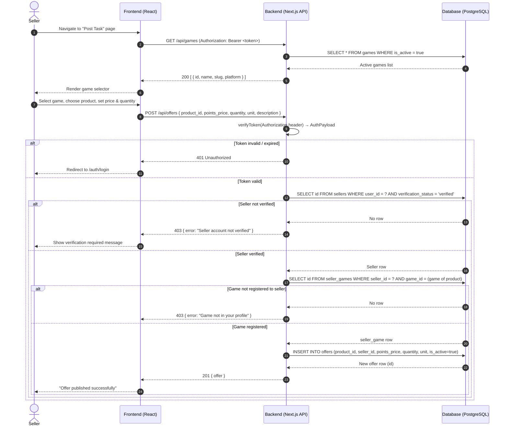

---

## 4. Browse Products

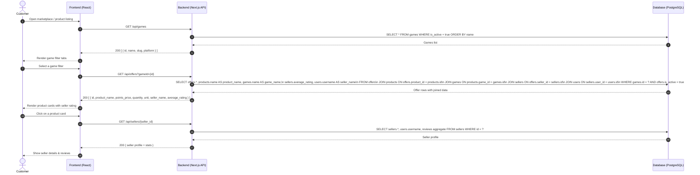

---

## 5. Add to Cart

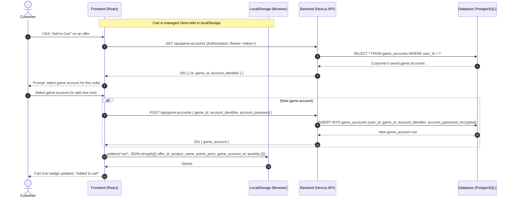

---

## 6. Checkout / Place Order

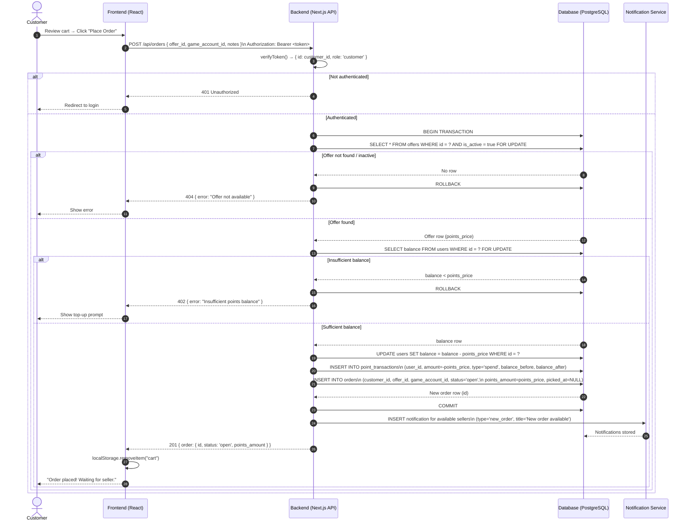

---

## 7. Order Tracking

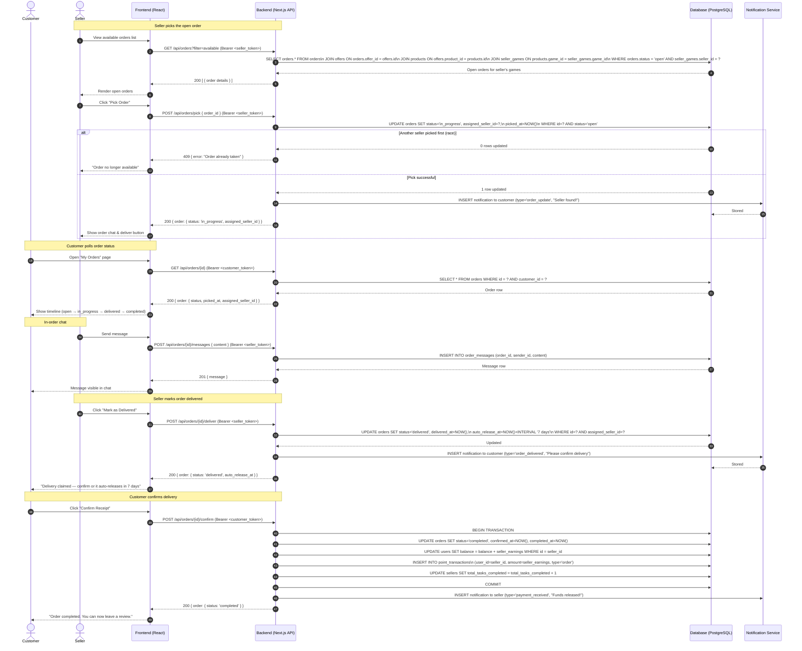

---

## 8. Admin Managing Products

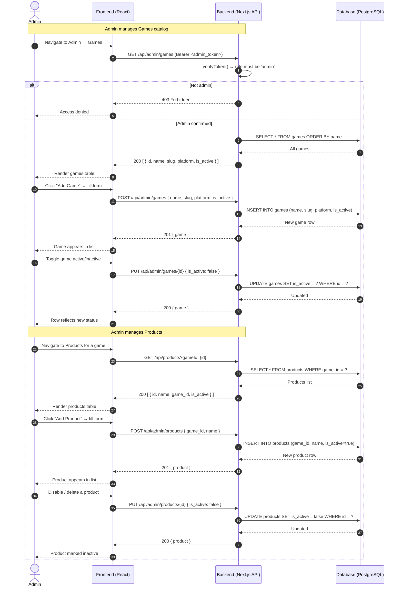

---

## 9. Admin Monitoring Orders

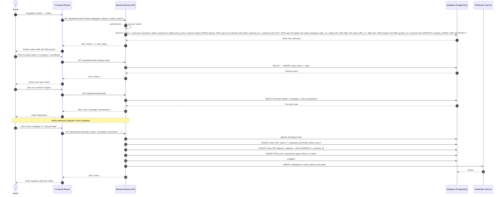

---

## 10. Review & Rating System

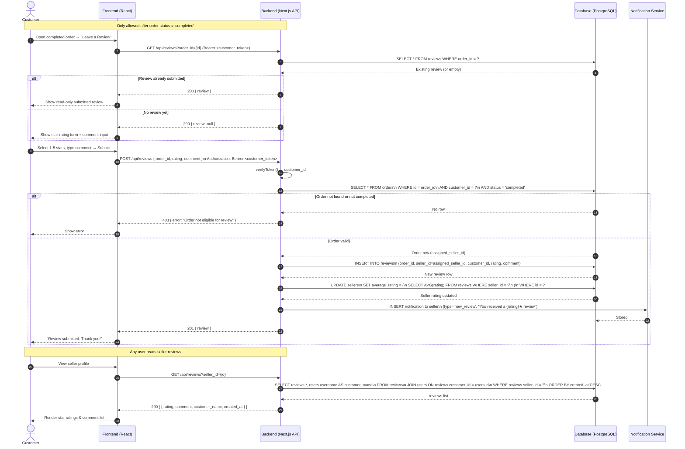

---

## 11. Recharge System (Points / USDT)

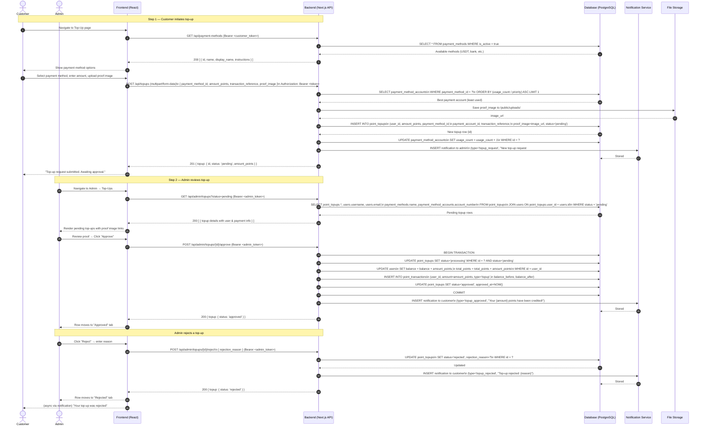

---

## 12. Telegram Bot — Order Tracking

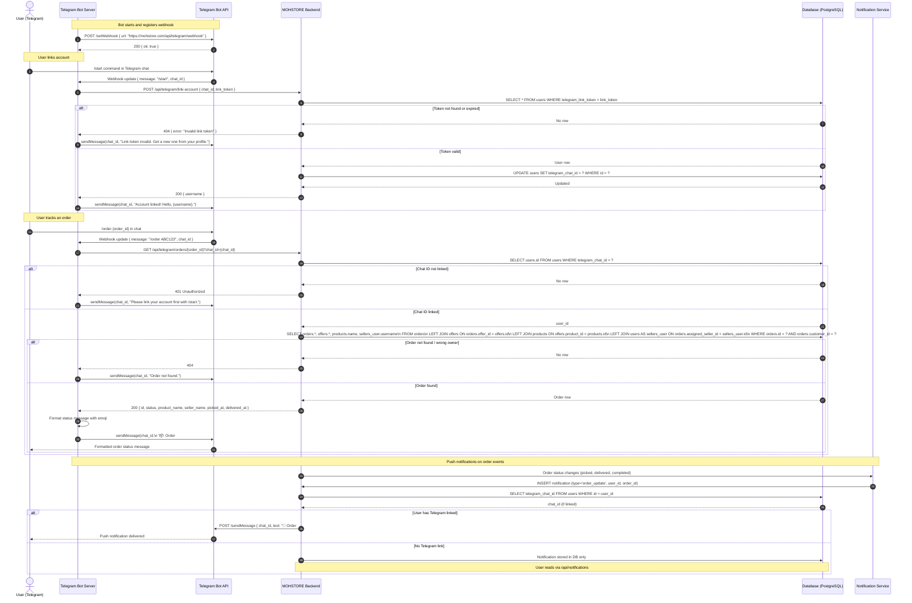

---

> **Notes:**  
> - Diagrams 1–11 reflect the **live codebase** implementation.  
> - Diagram 12 (Telegram Bot) is an **architectural blueprint** — the bot integration is planned but not yet implemented in the codebase.  
> - All authenticated endpoints use `Authorization: Bearer <JWT>` with a custom HS256 implementation (`lib/jwt.ts`).  
> - The database is PostgreSQL (Supabase) — SQL snippets in diagrams reflect actual query patterns found in the route handlers.
